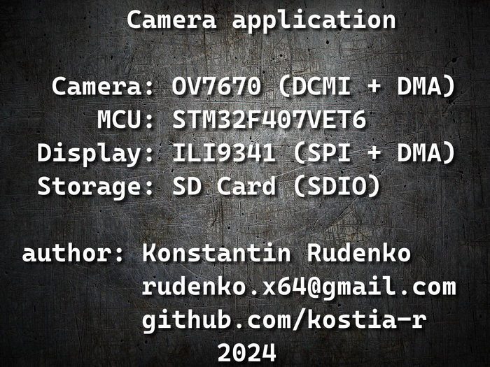

# CAMERA APPLICATION

Camera application on a bare-metal platform that streams video from an OV7670 camera to an ILI9341 SPI display, with photo capture and saving to an SD card. The system uses double-buffering to reduce memory consumption, achieving a frame rate of ~13 FPS by utilizing DMA for efficient data transfers. User input is handled by a single button with three press modes. Photos are saved in JPEG format on the SD card via SDIO and FatFS, using the LIBJPEG library.

NOTE: RTC(RealTime Clock) module is not used for FATFS in this project, so all saved images have the same hardcoded date & time.

## How to use:
### 1. Idle Mode
- **Purpose**: Acts as the default or home screen.
- **Interaction**: Press the **Left button** once to enter **VideoFinder Mode**.

### 2. VideoFinder Mode
- **Purpose**: Displays a live video feed and allows photo capture.
- **Interactions**:
  - **Left button single press**: Takes a photo.
  - **Right button single press**: Switches to **Photo Viewer Mode**.
  - **Left button double press**: Returns to **Idle Mode**.

### 3. Photo Viewer Mode
- **Purpose**: Enables browsing of saved images on the SD card.
- **Interactions**:
  - **Left/Right button single press**: Navigates through saved images (JPEG photos) on the SD card’s root directory.
  - **Right button double press**: Returns to **VideoFinder Mode**. 

This setup allows easy navigation: the **Idle Mode** is the home base, the **VideoFinder Mode** provides real-time video and photo capture, and the **Photo Viewer Mode** facilitates browsing through photos.

## Tehnology stack: Embedded Graphics, STM32F407VET6, OV7670, ILI9341, DCMI, SPI, I2C, SDIO, DMA, TIM, ISR, BUTTON, FatFS, LIBJPEG, HAL, CMSIS, Finite State Machines.
